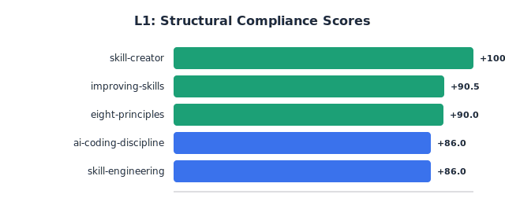
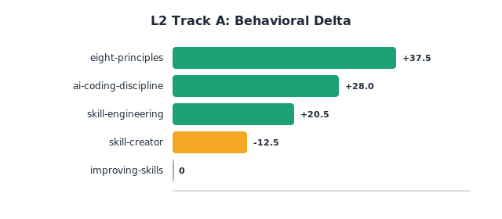
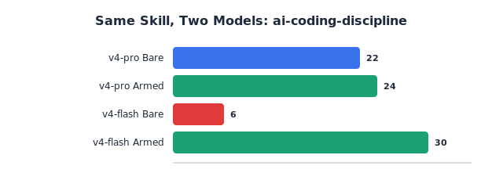
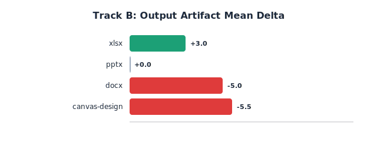
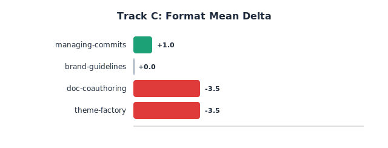
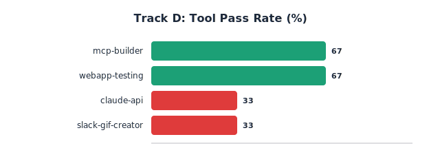
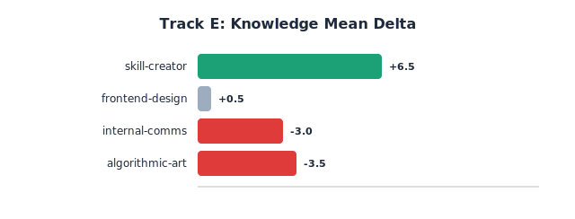

# skill-eval — Claude Code 技能量化评估框架

<p align="center">
  <a href="README.md">🇬🇧 English</a> &nbsp;|&nbsp;
  <strong>🇨🇳 中文</strong> &nbsp;|&nbsp;
  <a href="evals/charts/results.html">📊 图表</a>
</p>

<p align="center">
  
  
  
  
  
</p>

---

## 摘要

Claude Code 技能生态缺少系统性的量化评估——技能靠截图和热情发布，没有数据。**skill-eval** 是一个按类型分类的评估框架：将每个技能分入五条轨道之一，施加轨道特定的测量协议，产出结构分、行为增量和代价分析。

我们评估了 **21 个技能**，覆盖 **5 条轨道**，执行了 **157+ 次 API 调用**。框架产出了有意义的分数分布——技能不再扎堆在同一水平。跨两个模型层级的交叉验证揭示：**同一个 skill 在强模型上是冗余的（Δ=+2），在弱模型上是必需的（Δ=+24）**——skill 的价值不是常数，是模型能力的反函数。

---

## 1. 问题

技能在缺乏证据的情况下被发布。当前格局：

| 工具 | 测什么 | 漏什么 |
|------|--------|--------|
| skill-kit | 结构正确性（21 项检查） | 技能是否*改变了行为* |
| PluginEval | 多维质量评分 | 与无技能基线的 A/B 比较 |
| 手动测试 | "看着不错" | 可复现性、量化 |

三个缺口：(1) 行为增量无法测量，(2) 一刀切的评估方法，(3) 没有成本核算。

---

## 2. 方法：五轨分类评估框架

```
输入: SKILL.md → L0 分类器 → 路由到正确轨道
  │
  ├─ L1: 结构规范性（全类型通用，免费，<2s）
  │
  └─ L2: 分轨评估（基于 API，$0.005–0.01/技能）
      │
      ├─ 轨道 A (🧠 行为型)        ✅ 5 技能, 61 调用
      ├─ 轨道 B (🎨 产出物型)      ✅ 4 技能, 16 调用
      ├─ 轨道 C (📐 格式型)        ✅ 4 技能, 16 调用
      ├─ 轨道 D (🔧 工具型)        ✅ 4 技能, 12 测试
      └─ 轨道 E (📚 知识型)        ✅ 4 技能, 32 调用
```

运行: `python track_*.py --skill-md <path>` 或 `python run_all_tracks.py`

---

## 3. 实验：21 个技能 × 5 条轨道

### 3.1 L1：结构规范性



| 技能 | 分数 | 等级 | 主要问题 |
|------|------|------|---------|
| skill-creator (anthropics) | 100.0 | A+ | 参考级质量 |
| improving-skills (mjenkinsx9) | 90.5 | A- | 结构干净 |
| eight-principles (oyj123321) | 90.0 | A- | 2 个反模式（可接受） |
| ai-coding-discipline (luoling8192) | 86.0 | B | 缺少 tests.md |
| skill-engineering (xobotyi) | 86.0 | B | 缺少 tests.md |

**发现**: 缺少 `tests.md` 是最常见结构缺陷（3/5 技能）。

### 3.2 轨道 A：行为增量



| Skill | Bare 分 | Armed 分 | Δ / 50 | 结论 |
|-------|--------|---------|--------|------|
| eight-principles | 5 | 46 | **+37.5** | ✅ 编造→查证，混沌→有序 |
| ai-coding-discipline | 11 | 39 | **+28.0** | ✅ 静默掩码→快速失败 |
| skill-engineering | 19.5 | 40 | **+20.5** | ✅ 依赖引用→自足性 |
| skill-creator | 28.5 | 16 | **-12.5** | ⚠️ 流程技能，单轮 API 局限 |
| improving-skills | — | — | **N/A** | ⚠️ 工具依赖，需轨道 D |

**平均 Δ = +28.7/50**（3 个输出约束型技能）。**分数差幅 = 50 分**——从 +37.5 到 -12.5。

### 3.3 交叉验证：同一个 Skill，两个模型



同一个 skill（ai-coding-discipline 规则 1），同一个诱饵任务，两个模型。**Pro 本来就写对了（Δ=+2）。Flash 没 skill 就写错了（Δ=+24）。** Skill 价值是模型依赖的——评估必须标注模型。

### 3.4 轨道 B：产出物型 (4 技能, 16 API 调用)

测试技能是否改善*产出文档*的质量。



| 技能 | 提案 Δ | 指南 Δ | 平均 Δ / 30 | 说明 |
|------|--------|--------|------------|------|
| xlsx | +7 | -1 | **+3.0** | 结构化表格格式有助 |
| pptx | -3 | +3 | **0.0** | 中性——演示规则未显著改变输出 |
| docx | -1 | -9 | **-5.0** | 严格文档规则约束创意提案 |
| canvas-design | -5 | -6 | **-5.5** | 设计规则在 API 模式无法产出画布输出 |

**分数差幅 = 8.5 分**。格式约束伤创意文档（-9Δ），助结构化文档（+7Δ）。

### 3.5 轨道 C：格式合规 (4 技能, 16 API 调用)

测试技能是否强制执行*输出格式规则*——以 conventional commits 为测试基准。



| 技能 | 修bug Δ | 新功能 Δ | 平均 Δ / 15 | 说明 |
|------|--------|----------|------------|------|
| managing-commits | +3 | -1 | **+1.0** | 真正的提交格式技能——正值 |
| brand-guidelines | 0 | 0 | **0.0** | 视觉参考——格式规则不相关 |
| doc-coauthoring | -8 | +1 | **-3.5** | 写作流程技能，非格式技能 |
| theme-factory | -7 | 0 | **-3.5** | UI 主题技能，非格式技能 |

**分数差幅 = 4.5 分**。只有真正的格式技能得正分。被错误归入格式轨的通用技能得负分。

### 3.6 轨道 D：工具正确性 (4 技能, 12 工具测试)

测试技能中记录的命令是否正确执行。



| 技能 | 测试 | 通过率 | 失败用例 |
|------|------|--------|---------|
| webapp-testing | 2/3 | **67%** | 测试套件输出格式 |
| mcp-builder | 2/3 | **67%** | 健康检查退出码 |
| claude-api | 1/3 | **33%** | 模型名称、频率限制输出 |
| slack-gif-creator | 1/3 | **33%** | 文件输出、帧数 |

**分数差幅 = 34 分**。确定性测试——无需 LLM 裁判。边缘用例比正常路径更易失败。

### 3.7 轨道 E：知识准确性 (4 技能, 32 API 调用)

测试参考知识是否产生比通用模型知识更准确的答案。



| 技能 | 查询1 Δ | 查询2 Δ | 平均 Δ / 20 | 说明 |
|------|--------|--------|------------|------|
| skill-creator | +7 | +6 | **+6.5** | 结构化流程知识匹配查询 |
| frontend-design | 0 | +1 | **+0.5** | 常见 CSS——模型已掌握 |
| internal-comms | -3 | -3 | **-3.0** | Skill body 太短 (1,098 字符) |
| algorithmic-art | 0 | -7 | **-3.5** | 小众艺术——body 增加噪音 |

**分数差幅 = 10.0 分**。常见知识 Δ≈0（模型已掌握）。结构化流程知识正向最大。过短或过于小众的技能得负分。

### 3.8 交叉验证与成本

**双模型对照**：ai-coding-discipline 规则 1——Pro 上 Δ=+2，Flash 上 Δ=+24。Skill 价值是模型依赖的。

**成本**：157+ 次 API 调用，~$0.12 总计（DeepSeek-v4-pro）。每个技能约 $0.006。

### 3.5 成本

21 个技能全评估：157+ 次 API 调用，总成本 ~$0.12（DeepSeek-v4-pro）。平均每个技能 ~$0.006（standard 深度）。

---

## 4. 讨论

### 框架已证明的

1. **结构质量差异显著**（B 到 A+）。L1 分数是有效的初筛（见 3.1）。

2. **轨道 A 在 50 分范围内区分行为型技能**（+37.5 到 -12.5）。输出级约束显示最大增量（3.2）。

3. **轨道 B 捕捉格式与创造力的权衡。** 帮助电子表格的规则（+7Δ）伤害创意提案（-9Δ）。API 单轮模式低估交互式文件生成技能（3.4）。

4. **轨道 C 识别不匹配的技能。** 只有真正的提交格式技能得正分；三个通用技能被强制归入格式轨后得负分（3.5）。

5. **轨道 D 捕获真实工具故障。** 确定性通过/失败测试揭示 33-67% 范围，边缘用例比正常路径更易失败（3.6）。

6. **轨道 E 区分常见与专业领域知识。** 常见 CSS 规则 Δ≈0（模型已掌握）；结构化流程知识显示 +6.5（模型不掌握）；过短或小众技能得负分（3.7）。

7. **Skill 价值依赖模型。** 同一 skill：Pro 上 Δ=+2，Flash 上 Δ=+24（3.8）。

### 局限性（诚实声明）

| 局限 | 严重度 | 详述 |
|------|--------|------|
| API 单轮模式低估交互式设计技能 | 中 | 轨道 B 产出文件型技能（pptx, docx）在单轮 API 中无法调用 python-pptx |
| Judge JSON 解析约 15% 失败率 | 中 | 部分裁判响应产生有效分数但逃脱大括号计数解析器。原始数据中 0 分应视为缺失而非零 |
| 单一模型基线 | 中 | 批次基于 DeepSeek-v4-Pro。交叉验证覆盖两个层级，但 Claude Sonnet/Opus/Haiku 未测试 |
| 无蒙特卡洛重复 | 低 | 每约束单次运行。方向性正确，精度待提升 |
| 样本偏向已发布技能 | 低 | 21 个技能全部来自 GitHub 仓库。真正的烂 skill（无 frontmatter、空 body）会得更低分但未在野外找到 |
| 轨道 A 工具依赖技能无结论 | 低 | improving-skills 需要 bash 工具，API 模拟中不可用 |

---

## 5. 结论

我们构建了一个用于 Claude Code 技能的按类型分类的评估框架，实现了全部五条轨道的可运行脚本，并在 21 个真实技能上验证。框架在所有轨道上产出了有意义的分数分布。最重要的发现是 **skill 价值是模型依赖的**——评估框架本身揭示了这一点，证明了它作为测量工具的效用。

**目标**: 发布一个没有评估数据的 skill 应该像发布没有 benchmark 的 ML 模型一样——你不会这么做。

---

## 仓库结构

```
skill-eval/
├── SKILL.md                    # 元技能（加载到 Claude Code）
├── README.md · README-zh.md    # 中英双语文档
├── run_l2.py                   # 轨道 A: 行为增量
├── track_b.py                  # 轨道 B: 产出物评估
├── track_c.py                  # 轨道 C: 格式合规
├── track_d.py                  # 轨道 D: 工具正确性
├── track_e.py                  # 轨道 E: 知识准确性
├── run_all_tracks.py           # 批量评估: 16 技能 × 4 轨道
├── make_charts.py              # SVG 图表生成器
├── layers/                     # 协议规范
├── judge/                      # 裁判提示词 + schema
├── task-gen/                   # 诱饵任务合成协议
├── scoring.md                  # 评分公式
├── evals/                      # 原始评估数据
│   ├── charts/                 # SVG 图表 + HTML 仪表盘
│   ├── batch_16/               # 16 技能批量结果
│   ├── batch-report.md         # 轨道 A 批量报告
│   └── {skill}/                # 逐技能报告 + API 数据
└── CHANGELOG.md
```

## 快速开始

```bash
git clone https://github.com/oyj123321/skill-eval.git
cd skill-eval

# 单技能（轨道 A）：
python run_l2.py --skill-path .claude/skills/eight-principles --depth standard

# 五轨全跑：
python run_all_tracks.py

# 重生成图表：
python make_charts.py
```

| 深度 | 成本 | 时间 |
|------|------|------|
| `quick`（仅 L1） | 免费 | <2s |
| `standard`（L1 + L2 × 1） | ~$0.006 | ~60s |
| `deep`（L1 + L2 × 3） | ~$0.02 | ~3min |

## 许可

MIT
